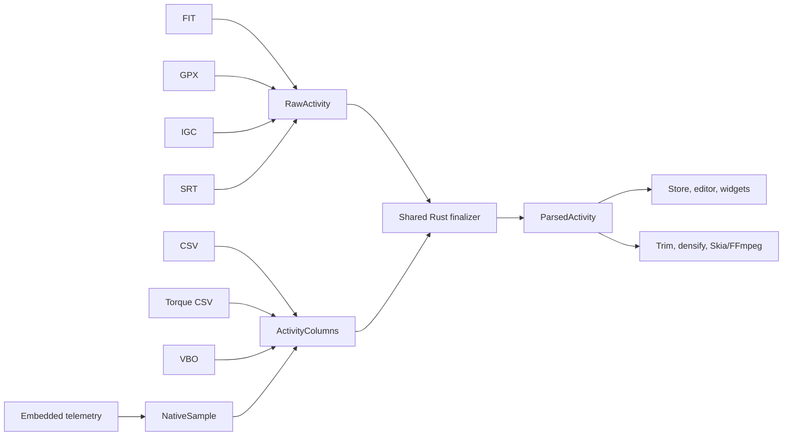

# Telemetry import architecture and recommendation

## Recommendation

**Keep the generic CSV importer for generic exporters, while routing
signature-verified Torque exports through a dedicated importer.**

The current importer is not a loose “best effort” parser. It is a strict,
capability-based adapter: exact header aliases, dimensional unit checks,
deterministic source precedence, explicit timestamp reconstruction, and
per-metric validation turn a family of exporter CSVs into one canonical model.
It already has fixture coverage for several unrelated exporters.

Evolve it into a **profile-capable generic importer** only when real fixtures
demonstrate a requirement that its present vocabulary cannot model. A profile
should declaratively supply a dialect/header/time policy and reuse the generic
column selection and shared finalizer. Add a fully dedicated importer only for
a format with non-tabular structure or semantics that cannot be expressed by a
profile. Do not create a Torque-specific importer until a Torque fixture proves
that need.

## Supported import routes

| Source | Edge parser | Intermediate form | Canonicalization |
| --- | --- | --- | --- |
| FIT | Browser `fit-file-parser` adapter | `RawActivity` | Rust finalizer |
| GPX | Browser DOM/XML adapter | `RawActivity` | Rust finalizer |
| IGC | Browser `igc-parser` adapter | `RawActivity` | Rust finalizer |
| DJI-style SRT | Browser, two subtitle layouts | `RawActivity` | Rust finalizer |
| CSV | Native Rust capability parser | `ActivityColumns` | Rust finalizer |
| Torque CSV | Native Rust Torque importer | `ActivityColumns` | Rust finalizer |
| Racelogic VBOX (`.vbo`) | Native Rust section/channel parser | `ActivityColumns` | Rust finalizer |
| Embedded video telemetry | Rust `telemetry-parser`, DJI AC004 fallback | `NativeSample` → `ActivityColumns` | Rust finalizer |

All activity imports end in `ParsedActivity`, which is stored in Zustand and
is the only input the preview/editor and renderer consume. This is the central
architectural boundary: format parsers own source quirks; the finalizer owns
cross-format derivation, coverage, and activity semantics.

## Per-format behavior

### FIT

`app/src/lib/activity/fit-parser.js` runs `fit-file-parser` in the browser.
The adapter requests metric-friendly output units (`m`, `m/s`, Celsius, bar),
maps FIT record fields and known alternate names into `RawSample`, preserves
session/file metadata, and opts into circular heading smoothing. It rejects a
FIT file that has no record messages. The shared finalizer fills/derives the
rest of the canonical activity model.

### GPX

`app/src/lib/activity/gpx-parser.js` parses XML in the browser and requires
track points. It reads standard `lat`, `lon`, elevation, and timestamp fields,
then recursively flattens leaf extension elements and matches a small alias
vocabulary for cadence, heart rate, power, speed, distance, gear, temperature,
and running/cycling metrics. It retains creator/activity-name metadata and
opts into heading smoothing. Extension names are normalized but values are not
unit-tagged; correctness depends on each recognized extension already using
the expected canonical unit.

### IGC

`app/src/lib/activity/igc-parser.js` uses `igc-parser` in lenient mode and
requires at least one B-record fix. It makes a timestamp-relative timeline,
preserves invalid-fix timeline slots while clearing their coordinates, and
maps GPS altitude plus optional IGC extensions: GSP to speed, TRT to heading,
VAT to vertical speed, and OAT to temperature. OAT uses one file-level scale
inference for whole/deci/centi-degree vendor variants. Parser warnings become
metadata rather than hard import failures.

### SRT

`app/src/lib/activity/srt-parser.js` recognizes two DJI subtitle layouts:
bracketed key/value telemetry and legacy line-oriented telemetry. Cue start
time provides elapsed time. It maps available GPS/elevation and camera fields,
uses local/naive timestamps for later timezone resolution, skips idle-gap
insertion, and requests smoothing for speed, vertical speed, elevation, and
heading. See `KNOWN_PROBLEMS.md` for a zero-value parsing defect in this path.

### CSV

`src-tauri/ovrley_core/src/activity/csv/` reads only comma-separated generic CSV; it
does not sniff a delimiter or recognize exporter/version names. It scans past
preamble rows for a header with recognized timing and non-timing columns, then
optionally accepts a compatible units row. Exact normalized aliases map columns
to canonical metrics. Candidate columns are ranked by source quality (GPS,
vehicle, calculated, accelerometer, etc.) and rejected independently when
their units or values are unusable.

It constructs a non-decreasing, zero-based timeline from elapsed and/or
absolute timestamps, coalesces duplicate times, validates values, converts
units, derives g-force/lean where possible, and emits `ActivityColumns`.
The generic importer works because source-specific differences are represented
as data—headers, qualifiers, units, and precedence—instead of as a branch per
exporter. Detailed CSV/Torque behavior is documented in
[`TORQUE_IMPORT.md`](TORQUE_IMPORT.md).

### VBO

`src-tauri/ovrley_core/src/activity/vbo/` is deliberately dedicated because
VBO is a sectioned whitespace format, not CSV. It requires valid UTF-8,
parses `[header]`, `[column names]`, and `[data]`, validates exact row widths,
and resolves Racelogic/RaceChrono channel identifiers plus qualifiers and
units. It handles VBO time-of-day, Unix timestamp, or elapsed-time timelines,
including midnight rollover. It converts standard VBO coordinate minutes and
positive-west longitude. The signature-declared RaceChrono v10+ dialect instead
supplies signed decimal-degree coordinates. It also normalizes speed/vertical-speed
units and vehicle channels before finalizing.

### Embedded video telemetry

`src-tauri/ovrley_core/src/media/mp4_telemetry/` primarily uses
`telemetry-parser` to read vendor metadata (notably GoPro GPMF, DJI, and
Insta360 tag shapes). It expands GPS, IMU, and camera vectors at their native
cadence, smooths continuous values, then aligns them onto GPS timestamps—or a
video-FPS timeline when GPS is absent—using closest-in-time matching. Camera
settings are held as discrete state, not interpolated.

If the primary parser cannot yield suitable DJI telemetry, the AC004 fallback
extracts a `djmd`/`DJI meta` track through FFmpeg and decodes an observed
protobuf subset. This route is a dedicated importer because the binary track
and vendor field hierarchy cannot be expressed as tabular columns. It has
known timestamp and coordinate-sentinel limitations recorded in
`KNOWN_PROBLEMS.md`.

## Why the generic CSV importer should remain

The CSV importer has the right separation of concerns:

1. **Discovery:** scans a flexible comma CSV for a usable header after an
   exporter preamble.
2. **Schema recognition:** exact aliases resolve semantic column meaning;
   source qualifiers describe provenance without changing output field names.
3. **Source selection:** the best usable candidate wins per metric, not per
   file, so mixed GPS/OBD/calculated exports work without exporter branches.
4. **Unit safety:** dimensions are checked before conversion. A bad speed
   column does not poison an otherwise valid route or RPM import.
5. **Timeline integrity:** elapsed and absolute time are reconciled before
   metric assembly; duplicate time rows are reduced deterministically.
6. **Shared semantics:** CSV does not duplicate downstream distance, coverage,
   timezone, smoothing, derivation, or widget logic.

Replacing it with dedicated importers would duplicate this policy across every
exporter, make mixed-source files harder to support, and increase the surface
area for output divergence. It would be justified only where a source has
semantics beyond column mapping.

## Recommended evolution

Retain the existing parser and add profiles when evidence requires them.

| Situation | Correct response |
| --- | --- |
| New comma CSV uses existing aliases/units | Add a fixture; no parser change. |
| New comma CSV needs extra aliases, source precedence, or units | Extend the generic registry with tests. |
| Known exporter needs a distinct but declarative header/time/dialect rule | Add a named profile selected by verified signature; reuse generic assembly. |
| Different delimiter, locale decimals, or quoted multi-line dialect | Add explicit dialect support to the generic parser, guarded by fixture tests. |
| Binary, sectioned, or vendor-packed data | Add a dedicated edge importer that emits `RawActivity` or `ActivityColumns`. |
| Proprietary PID names/IDs with device-specific scaling | Add a dedicated profile/importer only with a versioned fixture and documented mapping. |

Torque is handled by `activity::torque` when its `Trip Start Time` and
`Device Time` header signature is present. Keep its mapping isolated there and
add a representative fixture before supporting a new Torque header or unit
variant.

## Maintainer rules

- Add every new source format at the edge, never in widget or render code.
- Normalize source units and names once; do not add format-specific fallbacks
  to the finalizer, preview, or renderer.
- Preserve missing samples as missing. Do not turn malformed or unknown source
  values into a default value.
- Make a source’s timeline contract explicit and test time zones, rollover,
  gaps, duplicate timestamps, and sync-time behavior.
- Add a fixture before broadening an alias, profile, or vendor fallback.
- Keep `ParsedActivity` as the stable product contract; test `valid_attributes`
  and `extended_attributes`, because those determine widget availability.

## Evidence reviewed

This recommendation is based on the browser import adapters; activity schema,
finalizer, interpolation, CSV, and VBO modules; native MP4/DJI extraction;
Tauri commands; widget/store activation; and their import-focused frontend and
Rust tests. The MP4 end-to-end fixture test is currently ignored because its
video fixtures are not committed under `tests/fixtures/video/`; this limits
the confidence available from automated MP4 integration coverage.
