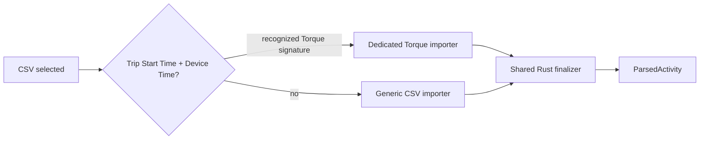

# Torque CSV import

Torque OBD exports use a dedicated Rust edge importer at
`src-tauri/ovrley_core/src/activity/torque.rs`. This is intentionally separate
from the generic CSV importer because Torque has a recognizable source schema
and direct OBD metric mappings.

## Routing

The desktop still selects a `.csv` file through the standard activity dialog.
`ovrley_core::commands::backend_parse_csv_activity` examines the first 16 CSV
records. A header containing both `Trip Start Time` and `Device Time`, or the
Torque GPS dialect signature `GPS Time` + `Device Time` + `Engine RPM(...)`,
is routed to `activity::torque`; every other CSV continues to use
`activity::csv`.

This makes the bypass explicit without changing the Tauri or frontend command
contract. A successfully identified Torque file has `file_format: "torque"`.

## Contract and mapping

Torque input is comma-delimited. Its `Device Time` must use one of these local
date-time layouts and increase strictly across at least two samples:

- `%m-%d-%Y %H:%M:%S%.f`
- `%Y-%m-%d %H:%M:%S%.f`
- `%Y/%m/%d %H:%M:%S%.f`
- `%d-%b-%Y %H:%M:%S%.f`, including the Portuguese month abbreviations used by
  the observed GPS dialect (for example `07-ago.-2026 08:04:27.153`).

When a coherent, strictly increasing elapsed-time column is available, it is
used as the relative timeline. Otherwise, `Device Time` defines that timeline.
`GPS Time` is retained as the absolute timestamp when it can be parsed; it
does not replace the relative timeline. The observed `Trip Time(Since journey
start)(s)` column is not used when it is non-monotonic (including repeated
initial zeroes).

The importer maps the following known Torque headers, retaining missing or
non-finite cells as missing samples:

| Torque header | Canonical metric | Canonical unit |
| --- | --- | --- |
| `Longitude`, `Latitude` | Course coordinates | degrees |
| `GPS Speed (...)` | Speed | m/s; km/h is converted |
| `GPS Altitude(...)` | Elevation | m |
| `RPM(...)` | RPM | rpm |
| `Throttle Position(...)`, `Accelerator Pedal Position(...)` | Throttle | % |
| any known `... Torque ...` column | Torque | Nm |
| `Trip Distance(...)` | Cumulative distance | km converted to m |
| `Estimated Torque (Nm)` | Estimated torque | Nm |
| `Estimated Power (kW)` | Estimated power | kW |
| `Estimated Power (CV)` | Estimated power | CV |
| `Estimated Gear` | Externally estimated gear | discrete integer |

Unknown columns are ignored. The importer deliberately does not interpret raw
PID numbers or custom PID scaling: adding such a mapping requires a fixture and
a documented source contract.

## Ownership and testing

The Torque importer only converts source rows into `ActivityColumns`. The
shared finalizer still owns validation, derived metrics, coverage, timezone
metadata, and the resulting `ParsedActivity`; no Torque logic belongs in React,
Tauri, widgets, or rendering.

`src-tauri/ovrley_core/tests/csv_activity.rs` covers Torque recognition,
dedicated parsing, metric conversion, and the non-Torque fallback decision.
